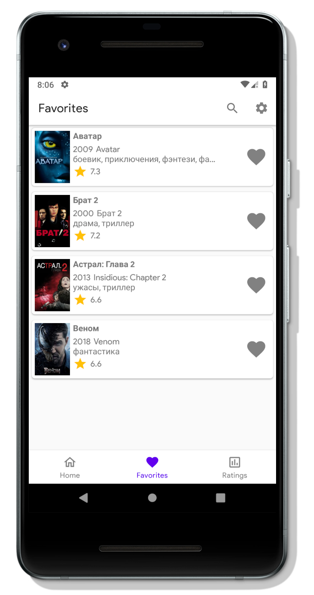

    

# ZUML: Cinemas Finder
Simple application to looking for movies

    
    

    
    

# Used technology stack
* Clean architecture
* MVP (Moxy)
* Retrofit 2
* Dagger 2
* RxJava 2
* Room
* Cicerone
* Butter knife
* Picasso
* Mockito
* Own Log implementation

# Submitting Bugs or Feature Requests
Just [create issue](https://github.com/AnDrOiD73dd/cinema-finder/issues/new)

# Documentation
We hope it will appear here.

# Contributing
We will publish the contributing rules later.

# License
ZUML is [Apache-2.0-licensed](LICENSE).